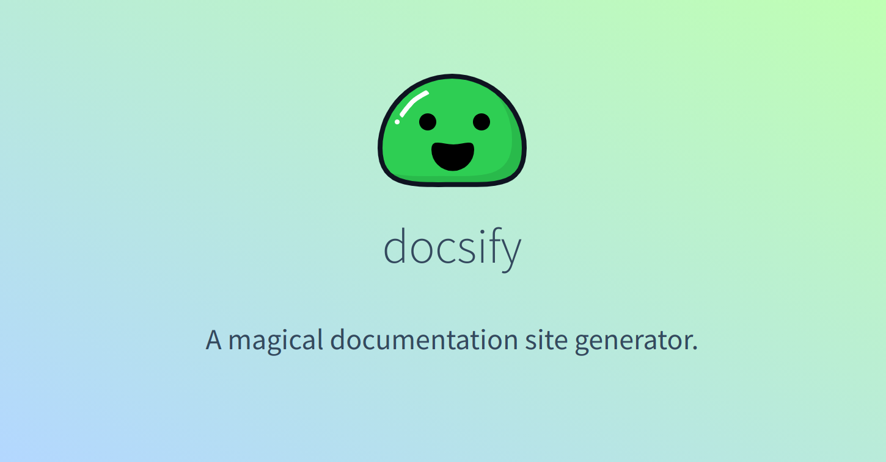

<!--
To README zostało automatycznie wygenerowane przez <https://github.com/YunoHost/apps/tree/master/tools/readme_generator>
Nie powinno być ono edytowane ręcznie.
-->

# Docsify dla YunoHost

[](https://ci-apps.yunohost.org/ci/apps/docsify/)


[](https://install-app.yunohost.org/?app=docsify)

*[Przeczytaj plik README w innym języku.](./ALL_README.md)*

> *Ta aplikacja pozwala na szybką i prostą instalację Docsify na serwerze YunoHost.*  
> *Jeżeli nie masz YunoHost zapoznaj się z [poradnikiem](https://yunohost.org/install) instalacji.*

## Przegląd

Docsify turns one or more Markdown files into a Website, with no build process required.

### Features

- No statically built html files
- Simple and lightweight
- Smart full-text search plugin
- Multiple themes
- Useful plugin API
- Emoji support


**Dostarczona wersja:** 4.4.4~ynh2

## Zrzuty ekranu



## Dokumentacja i zasoby

- Oficjalna strona aplikacji: <https://docsify.js.org/>
- Oficjalna dokumentacja dla administratora: <https://docsify.js.org/#/?id=docsify>
- Repozytorium z kodem źródłowym: <https://github.com/docsifyjs/docsify-cli/>
- Sklep YunoHost: <https://apps.yunohost.org/app/docsify>
- Zgłaszanie błędów: <https://github.com/YunoHost-Apps/docsify_ynh/issues>

## Informacje od twórców

Wyślij swój pull request do [gałęzi `testing`](https://github.com/YunoHost-Apps/docsify_ynh/tree/testing).

Aby wypróbować gałąź `testing` postępuj zgodnie z instrukcjami:

```bash
sudo yunohost app install https://github.com/YunoHost-Apps/docsify_ynh/tree/testing --debug
lub
sudo yunohost app upgrade docsify -u https://github.com/YunoHost-Apps/docsify_ynh/tree/testing --debug
```

**Więcej informacji o tworzeniu paczek aplikacji:** <https://yunohost.org/packaging_apps>
