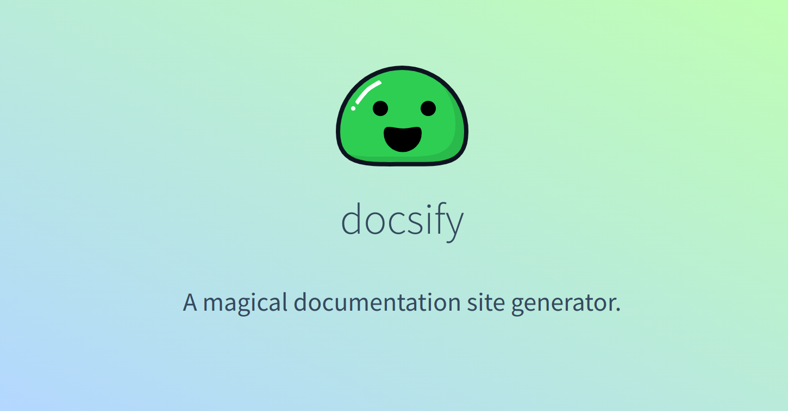

<!--
注意：此 README 由 <https://github.com/YunoHost/apps/tree/master/tools/readme_generator> 自动生成
请勿手动编辑。
-->

# YunoHost 上的 Docsify

[](https://ci-apps.yunohost.org/ci/apps/docsify/)  

[](https://install-app.yunohost.org/?app=docsify)

*[阅读此 README 的其它语言版本。](./ALL_README.md)*

> *通过此软件包，您可以在 YunoHost 服务器上快速、简单地安装 Docsify。*  
> *如果您还没有 YunoHost，请参阅[指南](https://yunohost.org/install)了解如何安装它。*

## 概况

Docsify turns one or more Markdown files into a Website, with no build process required.

### Features

- No statically built html files
- Simple and lightweight
- Smart full-text search plugin
- Multiple themes
- Useful plugin API
- Emoji support


**分发版本：** 4.4.4~ynh3

## 截图



## 文档与资源

- 官方应用网站： <https://docsify.js.org/>
- 官方管理文档： <https://docsify.js.org/#/?id=docsify>
- 上游应用代码库： <https://github.com/docsifyjs/docsify/>
- YunoHost 商店： <https://apps.yunohost.org/app/docsify>
- 报告 bug： <https://github.com/YunoHost-Apps/docsify_ynh/issues>

## 开发者信息

请向 [`testing` 分支](https://github.com/YunoHost-Apps/docsify_ynh/tree/testing) 发送拉取请求。

如要尝试 `testing` 分支，请这样操作：

```bash
sudo yunohost app install https://github.com/YunoHost-Apps/docsify_ynh/tree/testing --debug
或
sudo yunohost app upgrade docsify -u https://github.com/YunoHost-Apps/docsify_ynh/tree/testing --debug
```

**有关应用打包的更多信息：** <https://yunohost.org/packaging_apps>
